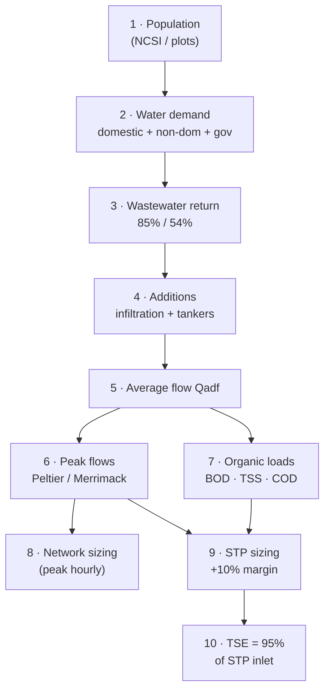

# Tutorial T01 — Sewage Flow & Pollution Load Calculation
**Project 2621 Ibri Sewer, TE & STP · Renardet / NWS · 2026-08-14**

> **This markdown is the quick-reference digest.** The full tutorial (Rev 1, 37 pp — teaching-level explanations, native equations, route flowcharts, charts, references, appendix) is `T01_Sewage_Flow_and_Load_Calculation.docx/.pdf` in this folder, addressing all Rev 0 review comments.

How to go from *population* to *design flows* and *organic loads*, step by step, using only the values the NWS manuals permit. Every number is cited: `p##` = PAM-GUD-203, `G1-p##` = PAM-GUD-201, `G2-p##` = PAM-GUD-202, `R0` = Ibri Inception Report R0 demand workbook (Aug 2026).

---

## The chain at a glance



---

## Step 1 — Population

Two routes, used together:

| Route | Formula | When | Ref |
|---|---|---|---|
| **Census (top-down)** | NCSI wilayat population → disaggregate to settlements by ratio | Model years 2030 / 2055 (growth projection) | G1-p58, R0 |
| **Plots (bottom-up)** | Population = plots × properties/plot × occupancy rate | Ultimate / saturation horizon | G1-p58 |

- Ibri wilayat (NCSI, in R0 workbook): **183,564 (2024)**, growth ≈ 2.4–3.0 %/yr.
- Scope horizons: start year, **2030, 2055, ultimate (saturated)**, 5-yr intervals (scope p3, p14–15).
- The design horizon is **completion + 25 yr or saturation**, whichever governs.
- Occupancy rate: take from NCSI (methodology fixed G1-p58); value per settlement to be confirmed with NWS.

> Rule of thumb: census route governs the *dated* model years; the plot route governs *ultimate*, because saturation no longer depends on growth rate.

## Step 2 — Water demand

All rates are litres per capita per day (l/c/d), Adh Dhahirah governorate:

| Component | Value | Ref |
|---|---|---|
| Domestic | **164** (IMP 2024 baseline; R0 computes 163.5 from actual 2021–24 billing — same number for practical purposes) | G1-p60, R0 |
| Non-domestic | + **22 %** of domestic = 36.1 | G1-p60–61 |
| Governmental | + **14 %** of domestic = 23.0 | G1-p60 |
| **Total water demand** | **223 l/c/d** | — |

Alternative for special land uses: unit rates (school 130 l/pupil/d, hospital 650 l/bed/d, shops 12.2 l/m²/d …) per G1-p61 Table 12 — use only where a large non-residential facility distorts the percentage approach.

## Step 3 — Wastewater return

Not all supplied water returns to the sewer (G1-p71 Table 19):

| Stream | Return rate | Per-capita result |
|---|---|---|
| Domestic (and tankered) | **85 %** | 164 × 0.85 = **139.4** |
| Non-domestic + governmental | **54 %** | (36.1 + 23.0) × 0.54 = **31.9** |
| **Wastewater generation** | — | **≈ 171 l/c/d** |

## Step 4 — Additions

| Addition | Value | Ref |
|---|---|---|
| Infiltration — **new** networks | **720 L/d per km** of sewer | G1-p72 |
| Infiltration — existing inland networks | 10 % of WW flow | G1-p72 |
| Yellow tankers | ≈ 17 % of STP inflow today; design coverage 100 % by end of planning period. R0 models tankers from settlements within **25 km** of the STP | G1-p73, R0 |

⚠ R0 currently applies **10 % infiltration** to (some) settlements. For the *new* Ibri network the manual value is 720 L/d/km — roughly ten times smaller. This must be reconciled at kickoff; until then state both.

No stormwater allowance — separate system by definition (G1-p72).

## Step 5 — Average flow

**Qadf** (average daily flow, = AAF annual average in GUD-203 terms):

```
Qadf [m³/d] = Population × 171 l/c/d / 1000  +  Infiltration  +  Tanker deliveries
```

Flow definitions used by the manuals (p65–66): **AAF** annual average · **MDF** maximum day · **PHF** peak hour.

## Step 6 — Peak flows

Two permitted formulas (G1-p71–72); apply to the sewage component (infiltration is not peaked):

| Formula | Expression | Gives |
|---|---|---|
| **Peltier (IMP 2024)** | PF = 1.5 + 1/√Qm , Qm in l/s | peak factor on average flow |
| Merrimack | Qpdf = 2.65 · Qadf^0.879 (both in Ml/d, > 100 properties) | peak daily flow directly |
| Cap | hourly PF ≤ **5.0** | — |

The two do **not** agree (see worked example: 1.72 vs 2.48). Peltier is the current IMP 2024 method; confirm the binding choice with NWS at kickoff. R0 additionally applies a **+20 % weekly peak** — an R0 assumption, not in the manuals.

## Step 7 — Organic loads

Per-capita loads are fixed minimums (p74) — they do *not* scale with water use:

| Parameter | Value | Ref |
|---|---|---|
| BOD₅ | ≥ **60 g/cap/d** | p74 |
| TSS | **80 g/cap/d** | p74 |
| COD | 1.8–2.2 × BOD (domestic) | p74 |

Concentration is derived, never assumed:

```
C [mg/l] = Load [kg/d] × 1000 / Q [m³/d]
```

Low per-capita water use ⇒ concentrated sewage. Expect BOD ≈ 300–400 mg/l here — if your calculation gives ~200 mg/l (European dilution), something is wrong.

## Step 8 — What each flow is used for

| Use | Governing flow | Extra rules |
|---|---|---|
| Gravity pipe sizing | Peak (hourly) flow | d/D ≤ 0.65 (D ≤ 350) / ≤ 0.50 (D > 350), v = 0.75–3.0 m/s, Table 11 min slopes (p26–29) |
| Pumping stations / force mains | Peak flow, any one pump out | v 1.0 (intermittent) – 2.5 m/s (p39, p50) |
| STP hydraulic pass-through | **PHF** | p65–66 |
| STP biology | **AAF + loads** | p65–66 |
| TE / TSE pipelines | TSE = 95 % of STP inlet | roughness penalty ε +30 % / C −10 % (G2-p104) |

## Step 9 — STP incoming flow

```
STP inflow = network Qadf (incl. infiltration) + tankered loads + 10 % operational allowance
```
(p65 Table 29, G1-p73). STP ≥ 20,000 m³/d ⇒ "Large" category (p65) and — per scope p3 — Phase I sizing decides whether the new STP stays in consultant scope.

## Step 10 — Outputs

- **TSE production = 95 %** of STP inlet (G1-p73) → feeds the TE network design.
- Sludge ≈ 0.25 kg/m³ treated (R0 planning rate; refine at process design).

---

## Worked example — settlement of 10,000 persons, 25 km of new sewers

| # | Step | Calculation | Result |
|---|---|---|---|
| 1 | Population | given | 10,000 cap |
| 2 | Water demand | 164 × 1.36 | 223 l/c/d → 2,230 m³/d |
| 3 | WW return | 164×0.85 + 59.1×0.54 | 171.3 l/c/d → **1,713 m³/d** |
| 4 | Infiltration | 720 L/d/km × 25 km | +18 m³/d (≈1 %) |
| 5 | **Qadf** | 1,713 + 18 | **1,731 m³/d = 20.0 l/s** |
| 6a | Peltier PF | 1.5 + 1/√20.0 | 1.72 → peak **34.5 l/s** |
| 6b | Merrimack | 2.65 × 1.731^0.879 | 4.29 Ml/d = 49.7 l/s (PF 2.48) |
| 7 | BOD / TSS / COD | 10,000 × 60 / 80 / 120 g | 600 / 800 / 1,200 kg/d |
| 7b | Concentrations | load / Qadf | BOD 347 · TSS 462 · COD 693 mg/l |
| 9 | STP inflow | 1,731 × 1.10 | **1,904 m³/d** |
| 10 | TSE | 1,904 × 0.95 | 1,809 m³/d |

Sanity checks that should always hold: BOD concentration 300–400 mg/l ✓ · PF between 1.5 and 5.0 ✓ · infiltration ≪ sewage for a new inland network ✓.

---

## Standard vs R0 — reconciliation register

| Item | Manual (binding) | R0 adopted | Status |
|---|---|---|---|
| Domestic LPCD | 164 (G1-p60) | 163.5 computed | ✓ consistent |
| Return ratios | 85 % / 54 % (G1-p71) | same | ✓ |
| Infiltration | 720 L/d/km new (G1-p72) | 10 % of WW | ⚠ reconcile at kickoff |
| Peak method | Peltier / Merrimack, PF ≤ 5 | + 20 % weekly peak | ⚠ confirm basis |
| Tanker catchment | not specified | 25 km radius | ⚠ NWS to confirm |
| STP margin / TSE | +10 % / 95 % (G1-p73) | same | ✓ |
| Sludge rate | — | 0.25 kg/m³ | R0-only planning value |

**Open inputs:** occupancy rate per settlement (GAP-5, partly closed by R0 NCSI data) · existing STP capacity & spare (GAP-7) · model start year.
