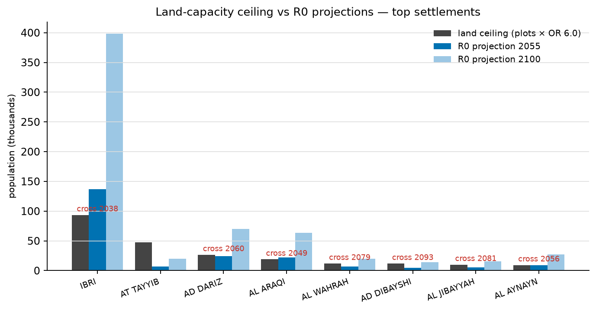
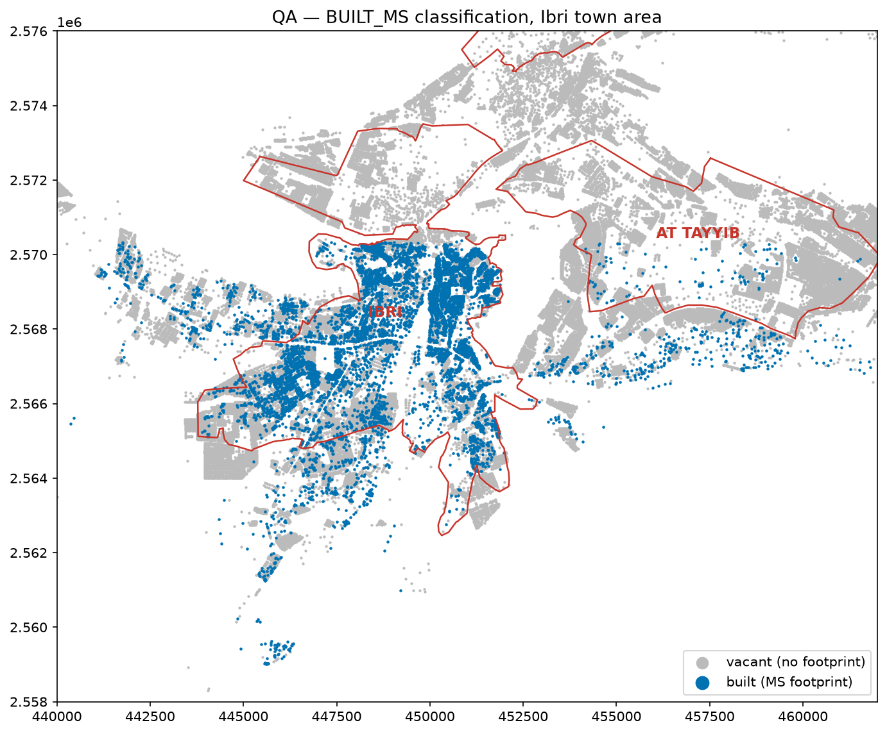

# A1 — Settlement Land-Capacity vs R0 Growth Projection, and Built/Vacant Plot Status
**W3 analysis · 2026-08-14 · screening grade**

Triggered by user flag: *IBRI settlement receives the largest projected growth, but its zone is largely built — does it have space?* Answer: **no — IBRI's land ceiling is crossed ≈ 2038 under the R0 allocation.**

## Method
1. Settlement boundaries: 26 town polygons from `Final_Boundary_IBRI.kmz` (R0 package), WGS84 → EPSG:32640.
2. Plots: MoH_Plots (61,272). Pop-basis plots = all except pure non-residential classes (agri, mosque, gov, comm, ind). Land ceiling = pop-basis plots × OR 6.0 `[GAP-5]` × 1 property/plot.
3. Projections: R0 workbook `Project Pop Settlements` (2023–2100). Crossing year = first year projection ≥ ceiling.
4. Built status: Microsoft Global ML Building Footprints (3 tiles, 18,567 in-region footprints) intersected with plots → `BUILT_MS` (≥12 m² roof inside plot). Output layer: `W3/shp/MoH_Plots_built.shp`.

## Key results
| Settlement | Plots | Ceiling (OR 6) | % built (MS) | Pop 2055 (R0) | Util. 2055 | Ceiling crossed |
|---|---|---|---|---|---|---|
| **IBRI** | 17,037 | 93,654 | **34.4 %** | 137,081 | **146 %** | **2038** |
| AT TAYYIB | 8,761 | 47,412 | **1.1 %** | 6,839 | 14 % | never |
| AD DARIZ | 5,525 | 26,676 | no coverage | 24,206 | 91 % | 2060 |
| AL ARAQI | 3,802 | 19,008 | no coverage | 21,849 | 115 % | 2049 |
| AL AYNAYN | 1,822 | 9,408 | no coverage | 9,303 | 99 % | 2056 |
| BAT | 939 | 4,026 | no coverage | 5,223 | 130 % | 2043 |
| Whole boundary | 61,167 | ≈ 325,600 | — | 237,900 | 73 % | ≈ 2070 |

Full table: [`A1_zone_capacity.csv`](A1_zone_capacity.csv).

## Findings
1. **R0's constant-census-share growth allocation is spatially impossible from ≈ 2038**: IBRI settlement's projected population exceeds its land ceiling decades before 2100 (398 k projected vs 94 k ceiling). Excess growth must physically relocate to headroom zones — above all **AT TAYYIB (99 % vacant, 47 k capacity)**, plus AL QURAYN, AL JAHLI, SAYH AL MASARRAT, WADI AL MANKAS.
2. **Flow-model consequence**: growth should be reallocated by *remaining capacity* (capacity-constrained, logistic per settlement), not census share. This shifts design flow from the town-core trunks toward the AT TAYYIB corridor — material for trunk sizing and options.
3. **Area-wide saturation ≈ 2070** (ceiling ≈ 326 k at OR 6.0) — beyond completion + 25 yr, consistent with the T01 horizon discussion; but zone-level saturation begins **inside the 2055 design horizon** (IBRI 2038, BAT 2043, AL ARAQI 2049).
4. **Built/vacant field now exists** (`BUILT_MS` in `W3/shp/MoH_Plots_built.shp`) but is trustworthy only where MS has coverage: IBRI core (34 % built, spatially coherent), AT TAYYIB, AD DIBAYSHI, AL JIBAYYAH, HIJAR, SUWAYDA AL MA (built/implied-dwellings ratios 0.7–1.05 = plausible). **Zero-coverage settlements (footprint model gaps, NOT empty towns): AD DARIZ, AL ARAQI, AL WAHRAH, AL AYNAYN, BAT, AL GHUBAYRAH, WADI AL MANKAS** — flagged `NO-COVERAGE` in the CSV.

## Caveats
- OR 6.0 and 1 property/plot are tagged assumptions (`GAP-5`) — ceilings scale linearly with both; NCSI housing units are the closing data.
- TANAM / SATWAH / AL MAKHTIBYAH kmz polygons do not capture their plot areas (projections ≫ plots inside polygon) — boundary fix needed; 24 of 50 workbook settlements have no polygon in the kmz.
- MS footprints are ML detections (2026-02 release): misses small/attached structures; use for screening; authoritative source = MoHUP building records / survey (data register).

## Recommendations
1. Adopt capacity-constrained growth reallocation in the demand model (per-settlement logistic against plot ceiling); rerun zone flows before concept options.
2. Add to kickoff data request: MoHUP building/completion records or licensed footprints; NCSI housing units (OR); corrected settlement boundaries (or agree to use MoH plot clusters instead of kmz towns).
3. User QA: spot-check ~20 `BUILT_MS` plots per class against Google Earth in the covered settlements; treat `NO-COVERAGE` settlements as unclassified.
