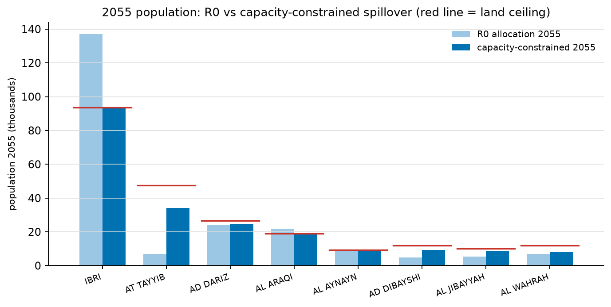

# A2 — Capacity-Constrained Growth Reallocation (Spillover Model)
**W3 analysis · 2026-08-14 · screening grade · follows A1**

User intent implemented: *growth does not stop when IBRI's land fills — people settle in zones sharing boundaries with IBRI.* Total growth is conserved; only its location changes.

## Method
Year-by-year (2023–2100): each settlement takes its R0 growth up to its land ceiling (pop-basis plots × OR 6.0 `[GAP-5]`); excess spills to neighbouring settlements (boundary distance < 3 km) in proportion to *remaining* capacity, cascading outward ring by ring. Settlements with unreliable boundaries (TANAM, SATWAH, AL MAKHTIBYAH, USAYBUQ, ASH SHIAB) keep their own R0 growth but are excluded as spill receivers (unknown capacity ≠ infinite capacity). Script: [`py/a2_spillover.py`](../py/a2_spillover.py); table: [`A2_spillover.csv`](A2_spillover.csv).

## Key results (2055, design horizon)
| Settlement | Ceiling | R0 2055 | Spillover 2055 | Shift |
|---|---|---|---|---|
| IBRI | 93,654 | 137,081 | **93,654** | **−43,427** |
| **AT TAYYIB** | 47,412 | 6,839 | **34,113** | **+27,274** |
| AD DIBAYSHI | 11,940 | 4,925 | 9,392 | +4,467 |
| AL QURAYN | 7,230 | 1,121 | 4,833 | +3,713 |
| AL JIBAYYAH | 10,140 | 5,486 | 8,887 | +3,401 |
| AL JAHLI | 5,922 | 847 | 3,926 | +3,079 |
| AL ARAQI | 19,008 | 21,849 | 19,008 | −2,841 |
| BAT | 4,026 | 5,223 | 4,026 | −1,197 |

Totals conserved: 237,885 persons in both allocations (2055).

## The deeper finding — the boundary itself saturates
With ceilings at OR 6.0 / 1 property per plot, the **whole project area runs out of land ≈ 2062–2070**. Cumulative population that the R0 projection generates but the boundary *cannot house*:

| By | Unhoused surplus |
|---|---|
| 2062 | 5,400 |
| 2070 | 62,800 |
| 2080 | 151,500 |
| 2100 | **406,700** |

Interpretation — one of three things must be true, and NCSI/MoHUP data decides which: (i) occupancy/properties-per-plot are higher than assumed (ceiling underestimated), (ii) MoHUP will subdivide new land (plot count grows), or (iii) the R0 wilayat projection overshoots the developable reality after ~2060. Until resolved, **flows beyond ~2062 derived from unconstrained R0 numbers are not physically meaningful**.

## Design implications
1. **2055 flows shift materially**: AT TAYYIB's population (and sewage) is ×5 the R0 allocation — its collector corridor and trunk connection must be sized for ~34k persons, not 7k. IBRI-core trunks correspondingly relieve.
2. Pipe sizing is unaffected in principle (pipes use the saturation ceiling per zone regardless), but **STP phasing and per-trunk flow splits at 2030/2055 should use the spillover allocation**, not R0's census shares.
3. Kickoff items sharpened: NCSI housing units (OR), MoHUP subdivision pipeline / land bank, corrected settlement boundaries — these now gate not just accuracy but *physical plausibility* of the demand model beyond 2060.

## Caveats
Everything scales with OR 6.0 and 1 property/plot; adjacency threshold 3 km; spillover assumes people relocate to nearest capacity (no economic weighting); 24 workbook settlements without polygons excluded (small).
