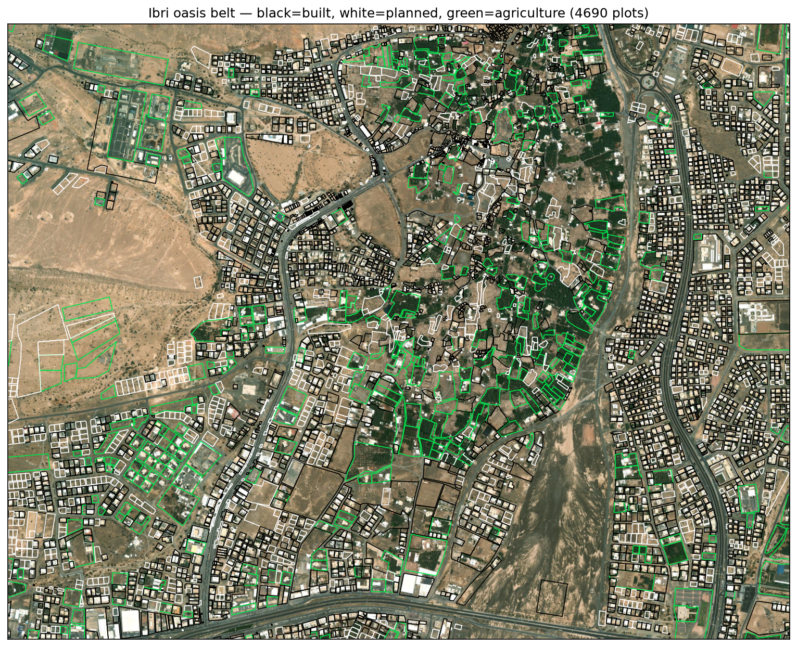

# A6 — Agriculture Class and Empty-LANDUSE Characterization (Layer v4)
**W3 analysis · 2026-08-15 · answers user review: farms shown white + 65 % of plots lack LANDUSE**

## Problem
The v3 style was binary — an active palm grove is neither "built" nor a "future plot", yet displayed white (planned). And 39,838 of 61,272 plots (65 %) carry an empty LANDUSE attribute, so the cadastre cannot say which are farms.

## Solution — imagery-based vegetation class
Per-plot vegetation fraction from the z17 RGB mosaic (excess-green + dark-canopy index), combined with plot size to separate farms from residential gardens:

- **AGRI if** vegfrac ≥ 0.55 and area ≥ 2,000 m², **or** vegfrac ≥ 0.85 and area ≥ 800 m²; explicit agricultural LANDUSE always AGRI.
- Validation: **100 %** of known agricultural plots captured; **2.2 %** false-agri rate on known residential plots.

Layer: [`MoH_Plots_class_v4.shp`](../shp/) — `CLASS` (B/P/A) with 3-class QML: **black = built, white = planned, green = agriculture**; carries `BUILT_FIN`, `VEGFRAC`, `PROB18`, `AREA_M2` for filtering.

## Empty-LANDUSE plots — characterized
| Imagery-based class | Count | Share of 39,838 |
|---|---|---|
| Built | 14,408 | 36.2 % |
| Agriculture (est.) | 2,345 | 5.9 % |
| Planned / vacant | 23,085 | 57.9 % |

Whole cadastre (v4): built 17,961 · agriculture 6,366 · planned 36,945.

## Design relevance
- Agricultural plots generate no sewage demand as such (farm dwellings do — flagged where built structures coexist with groves) and are TE-network *customers*, not sewer loads: the AGRI class feeds the TE demand mapping directly.
- Population-basis plot counts in A1/A2 ceilings should exclude the ~2,345 newly identified farms among empty-LANDUSE plots — a ~1–2 % ceiling correction, applied at the next capacity rerun.
- Small oasis garden parcels below the size gate remain white; lower the gate or hand-mark if they matter for TE mapping.

## Caveats
Screening grade; imagery greenness is seasonal (single Esri capture); explicit MoHUP land-use completion remains the authoritative fix (data register).
