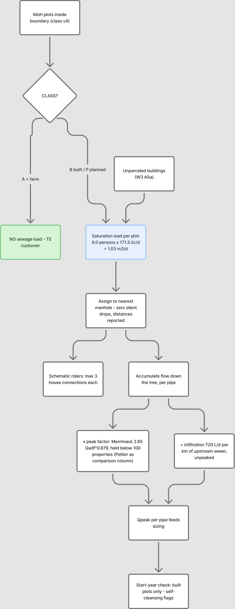
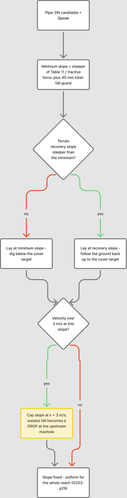
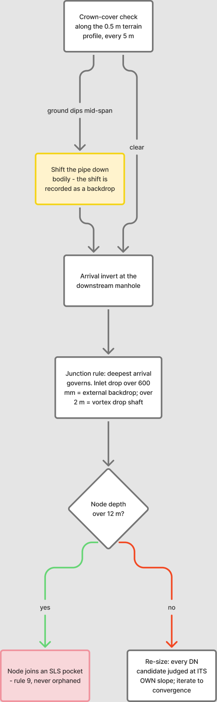

# W4 Sewer Network Design Pipeline — Methodology & Test-Boundary Results

> **SUPERSEDED — kept as the record of W4.** The live design is **W5**; see `_BRAIN/00_CURRENT.md` for what is current. Numbers here use one property per plot and 6.0 people per property, both replaced on 2026-08-19.

Internal working document · 2026-08-18 · code: `W4/py/sewnet/` · run: `W4/run/` · outputs: `W4/{shp,sewergems,dxf,img}` · QGIS group: **Claude W4**

---

## Executive summary

We built the sewer design pipeline, proved it end to end on the 551 ha test boundary, put it through a 21-agent adversarial review **and a two-rule structural audit you called for** (no loops; one outlet per chamber), fixed everything both found, and the design now holds those rules with **two marginal residuals out of 2,137 chambers**. Here's the whole story in one page.

The pipeline takes four inputs — roads, classified plots, the 0.5 m terrain, and a boundary — and produces a complete gravity network: **2,137 manholes, 90.4 km of pipe (95% DN200, stepping through DN250–500 to a DN600 outfall leg), designed inverts everywhere, ~11 seconds to run**. Every one of the **2,987 loaded units** (2,217 built plots, 522 planned, 248 unparceled buildings; 86 farms excluded per doctrine) lands on exactly one manhole — nothing silently dropped, mass balance closes exactly. Saturation flow at the outfall: **Qadf 3,070 m³/d, peak 83 L/s** (Merrimack).

The hydraulics were never taken on faith, and the verification regime earned its keep. The Colebrook-White solver had to reproduce all nine minimum gradients of G203 Table 11 (±5%) before it was allowed to size anything — it does, mean deviation under 2%. Then the adversarial panel attacked the code and **confirmed 11 real defects, all now fixed**, the big four being: my spanning tree covered every road junction but skipped 25 km of cross-street edges (fixed with the standard crest-manhole layout — summit split, draining both ways); pipe capacity was computed on nominal diameter while OD-designated PVC-U actually bores ~6% smaller (now computed on true SDR34 bore, ~15% capacity correction); a broken bisection in the velocity-cap solver; and drop structures measured against the wrong datum (now inlet-to-outgoing invert, independently re-audited). 43 pytest cases lock all of it in.

The honest self-cleansing picture, on the table rather than under it: **95% of pipes can't reach 0.75 m/s at saturation peak** — physically inevitable on small residential branches — and comply through the guideline's own tractive-force alternative at τ = 1 Pa, which is a **pending assumption [GAP-9]**. If NWS sets τ = 2 Pa, 1,515 pipes need steeper slopes. That single number is now the strongest argument for pinning τ down at the kickoff.

Three findings from the test area for your eyes:

1. **The outfall landed 733 m from where you expected** — the terrain's lowest boundary road node is at (450614, 2567397), south-center on the main corridor, z 351.2 m, not the west edge. If the real trunk connection is elsewhere, it's one config line and a 13-second re-run.
2. **Your elevated-roads concern was justified**: 289 units (9.7%) couldn't gravity-connect at standard sewer depth. Deepening 211 manholes recovered all but **10**, now flagged as local-solution candidates (`W4_lowplots.shp`, map M3).
3. **Two SLS pockets** (28 nodes, ~5 properties total) — absorb-to-detail-design per rule 9. The mechanism works; expect real candidates on harder terrain study-wide. **382 drop structures** (225 needing vortex-class shafts) concentrate at wadi-bank crossings — exactly where detail design will apply the G1-p85 crossing rules.

**The structural audit found something the graph checks had hidden** (§4a): the tree gave every *node* one outlet, but 255 chambers sat within 3 m of another chamber — many at the same point — each with its own outlet. On the ground that is a two-outlet junction, exactly what the rule forbids. The pipeline now merges coincident chambers, re-derives the tree over the merged set (which also removes loops that merging exposes), and offsets every extra outgoing pipe so it starts at the next house connection or 10 m clear of the chamber — the SWNETWROK convention, which I had *not* adopted until you asked.

Also delivered on the way: **T01 Rev 3** — the tutorial now teaches Colebrook-White (§14), Table 11 derived step by step, every number independently verified.

What's proven: doctrine loads in, guideline-compliant network out, auditable and re-runnable, honest about its assumptions. What's not yet proven: SewerGEMS agreement (the import package and pipe-by-pipe referee table await your ModelBuilder run), and behavior at 36-zone scale with your finalized trunk. That's W5.

---

## 1. What the pipeline is

A re-runnable Python package (`sewnet`) that designs a gravity sewer network inside any boundary, given roads, loaded plots, terrain, and an outfall/connection point. One config file (`config_test.py`) holds the paths; `criteria.py` holds every design number with its PAM-GUD page reference — no number lives anywhere else in the code.

*Blue = inputs, yellow = the audit gate, red = SLS flag, dashed = iteration loops. Editable: [Figma](https://www.figma.com/board/U3NFlSh7SFDL5C8jTcdQrp)*

Stages, in one breath: repair and clip the inputs → node the roads and collapse dual carriageways → grow a loop-free tree toward the outfall (climb-penalized, arterial-preferring — the "no alleys" lesson) → add cross-street branches wherever loaded plots front an off-tree street (summit-split, crest-manhole layout) → place manholes (junctions, bends >45°, ≤100 m spacing, sub-2 m reaches contracted) → load every plot at saturation → accumulate flows with peak factor and infiltration → size pipes and solve inverts together on the true pipe bore → check every house can physically reach its manhole, deepening where roads are elevated → audit everything independently → export SHP/SewerGEMS/DXF/maps.

## 2. The hydraulic basis (and how it's verified)

| Element | Basis | Verification |
|---|---|---|
| Capacity/velocity | Colebrook-White, ks = 1.5 mm, ν = 1.141e-6 m²/s (G203-p24/25/28), partial-full circular geometry, **true internal bore** (PVC-U OD-series derated to SDR34 ID; GRP nominal = ID) | **Table-11 gate**: reproduce all 9 minimum gradients at 0.75 m/s ±5% — passes at <2% mean deviation; ID convention unit-tested |
| Min gradients | Steeper of Table 11 (p29) and tractive force Smin = 2.33e-4·τ^1.23·Q^-0.461 (p27, A9-corrected), plus a 40 mm total-fall guard per reach (p29 §4.3.1) | τ = 1 Pa tagged [GAP-9]; Q floored at Mara's 1.5 L/s minimum design flow — at the floor, tractive ≈ Table 11 DN200: the methods meet |
| d/D limits | ≤0.65 (D≤350), ≤0.50 (D>350) at peak (p27 Tab 10) | enforced in sizing, re-checked in audit on the true bore |
| Velocity band | ≥0.75 m/s at peak or tractive-compliant (p26–27); ≤3.0 m/s via a slope cap whose surplus fall becomes a designed drop | audit + the transparency stats in §5 |
| Loads | Doctrine §2: every plot at saturation, 6.0 × 171.3 l/c/d ≈ 1.03 m³/d/plot; farms zero; infiltration 720 L/d/km unpeaked; PF Merrimack (mandatory >100 properties), held at its 100-property value below; Peltier comparison column held the same way | mass balance to the outfall closes exactly; unknown CLASS values can never vanish silently |

## 3. How the solver designs a pipe

Two passes per reach, iterated until no diameter changes (2 iterations sufficed; oscillation between adjacent DNs is detected and broken upward; a final lay pass always leaves inverts consistent with final diameters):

| Step 1 — slope | Step 2 — profile & depth |
|---|---|
|  |  |

The details that matter:

- **Uniform slope per reach** (p29) — one straight line between manholes, never kinked.
- **The chamber datum is the outgoing invert** (adversarial-review correction): manhole depth is construction depth, and every inlet drop is measured inlet-invert minus outgoing-invert — so velocity-cap surpluses and cover shifts combine into the drop they physically are. >600 mm = external backdrop, >2 m = vortex shaft (p30), and the audit re-derives every drop independently — any missing or misclassified record is a violation.
- **Mid-span cover on real terrain**: every reach profiled at 5 m on the 0.5 m VRT; a reach riding above dipping ground is shifted down bodily, the shift surfacing as a recorded drop.
- **Sizing without the ratchet**: every candidate DN is judged at *its own* governing slope (no-oversizing, p29), on its true bore, with velocity-infeasible candidates (the fixed `smax` sentinel) skipped explicitly.
- **>12 m depth → SLS pocket** (p33 + rule 9), never a silent orphan.

## 4a. Loop-free, and one outlet per chamber (your two rules)

Both rules are enforced constructively, not checked after the fact — and both are verified independently on the final output.

**No loops.** The collection network is a spanning tree by construction: a cost-weighted shortest-path tree to the outfall, where each chamber's single outgoing pipe is its next hop. Loop-closing street edges can never become pipes in that step. Final output: 2,137 chambers, 2,136 pipes, one connected component, acyclic — the pipe count *being* chambers-minus-one is the arithmetic signature of a tree.

**One outlet per chamber.** A junction takes any number of inlets and exactly one outgoing pipe. The catch the graph checks missed: two *separate* chambers can sit at the same physical point (road noding rounds to the centimetre, and the cross-street augmentation planted branch heads next to existing junctions). Each had one outlet in the graph; together they were a two-outlet junction on the ground. The fix, in order:

1. **Merge** every cluster of chambers within 3 m — they are one structure — which makes the hidden fan-outs visible as chambers with two outgoing pipes;
2. **re-derive the tree** over the merged pipe set, because merging can also close a loop (two chambers at one point may additionally be linked by a path). This restores one-outlet-and-no-loops in a single step and marks the leftover pipes as loop-closers;
3. **offset every leftover pipe** so it starts clear of the chamber: at the **next house connection** along its own alignment, or **10 m** when that connection sits nearer — the SWNETWROK `FANOUT_GAP_M` convention, adopted at your instruction. A branch whose pipe is too short to keep a clear start is dropped and reported (its street is served from the far end);
4. **slide any remaining branch head** clear of neighbouring chambers, iterating until nothing moves.

Test-area result: 255 coincident chambers merged, 125 fan-outs resolved, **357 branch starts offset**, 90 branches dropped as served-from-far-end. Independent verification on the exported network: loop-free PASS, one-outlet PASS, 568 of 569 branch heads at least 10 m clear, one chamber pair at 2.78 m instead of 3.0 m. Those two residuals are reported rather than hidden — both are local layout details for detail design, and the audit will keep flagging them.

The same three checks now run in the audit every time (`mh-clearance`, `head-offset`, `one-outlet`), with a unit test on a synthetic two-chambers-at-one-point case, so this cannot regress silently.

## 4. The house-connectability check (your elevated-roads mandate)

For every loaded unit: plot ground (0.5 m terrain) minus 0.6 m outlet depth must reach its manhole's invert with 2% fall over the connection distance. Fails → the manhole gets a deepening requirement (capped 0.5 m short of the 12 m limit) and the invert solve re-runs; still failing → local-solution flag. Test area: **293 flagged → 213 manholes deepened → 12 residual** (map M3, `W4_lowplots.shp`). The schematic rider layer (≤3 house connections per rider, PCS ≤50 m checked) is `W4_riders.shp` — drawn and rule-checked, hydraulically lumped at manholes per the agreed concept scope.

## 5. Test-boundary results

| Quantity | Value |
|---|---|
| Area / roads / network | 551 ha / 98.7 km roads / **90.4 km sewers** (22.2 km of it from cross-street augmentation; 0.56 km of unloaded streets deliberately unsewered) |
| Manholes / pipes | 2,137 / 2,136 (single tree, one outfall — chambers minus one) |
| Diameters | DN200 86.2 km · DN250 1.7 · DN315 1.8 · DN400 0.29 · DN500 0.39 · DN600 0.08 km |
| Loaded units | 2,987 (B 2,217 + P 522 + unparceled 248); farms excluded 86 |
| Outfall | (450614, 2567397), z 351.24 — 733 m from user expectation, see exec summary |
| Qadf / Qpeak at outfall | 3,070 m³/d / 83 L/s (PF Merrimack; Peltier column in shapefiles) |
| Structure rules (§4a) | 255 coincident chambers merged · 125 fan-outs resolved · **357 branch starts offset** · 90 branches dropped as served-from-far-end |
| Depths | max 15.1 m (inside an SLS pocket); gravity network otherwise ≤ 12 m |
| Drops | 382 designed structures; 225 vortex-class (>2 m), concentrated at wadi-bank crossings |
| SLS pockets | 2 (28 nodes, ~5 properties total → absorb per rule 9) |
| Low plots | 289 flagged → 10 residual after deepening 211 manholes |
| Audit | **2 violations** — both structural residuals (one chamber pair at 2.78 m vs the 3.0 m clearance; one branch head at 9.1 m vs the 10 m offset). Everything else clean, including independent drop re-derivation |
| Self-cleansing transparency | 2,038/2,136 pipes below 0.75 m/s at saturation peak — compliant via tractive @ τ=1 Pa [GAP-9]; **1,515 would need redesign at τ=2 Pa**; start-year (built+unparceled): 2,082 flags, all tractive-compliant (operational, p28 §4.2.6) |
| Runtime | ~11 s design + ~4 s exports |

Maps: `img/W4_M1_network_by_dn.png`, `M2_depth`, `M3_connectability`. CAD: `dxf/W4_test_boundary_design.dxf`. GIS: QGIS group **Claude W4** (saved).

## 6. SewerGEMS package & referee protocol

`W4/sewergems/`: MANHOLES/CONDUITS/OUTFALL shapefiles per the Bentley-documented ModelBuilder mappings (explicit START_ND/STOP_ND + vertex-snapped geometry digitized up→down, elevations not depths, numeric mm diameters), LOADS.xlsx (1,204 pattern-based rows, L/s per manhole), Manning n exported as **0.013 — the ks = 1.5 mm equivalent** (review finding: the Tab-8 0.009–0.011 range conflicts with the ks mandate and would show ~30% phantom capacity; flagged as an NWS kickoff item), and `IMPORT_PROCEDURE.md` with the known traps (`Set Invert to Start/Stop Node = False` being the one that silently deletes drop manholes). After your run, paste results into `REFEREE_pipes.csv`; >5% deviation on any pipe = open investigation. The design isn't "verified" until the two engines agree — deliberately your run, not mine.

## 7. Assumptions register (tagged, not hidden)

τ = 1 Pa [GAP-9] · tractive Q-floor 1.5 L/s (Mara) · PVC-U wall class SDR34/SN8 for the true bore [PAM-SPC-207 pending] · OR 6.0 & 1 property/plot [GAP-5] · plot outlet depth 0.6 m & 2% connection fall · 40 m frontage rule for cross-street sewers · **10 m branch-start offset and 3 m chamber clearance (layout conventions from SWNETWROK/user, not PAM-GUD values)** · manhole size ladder (02 has no table — GUD-203 §4.4 re-extract pending) · rider discharges to nearest manhole · gravity in-road position from the force-main clause (p51, A9) · PF held below 100 properties (G1 prescribes no formula there; Peltier column held the same way) · infiltration unpeaked [kickoff] · wall+bedding 0.05 m under crown cover. All in `criteria.ASSUMPTIONS` with the same wording.

## 8. Limitations & what changes at full scale

- **The trunk is yours** (settled 2026-08-18); the pipeline designs subnetworks into your connection points — config entries, nothing structural.
- One outfall per run today; multi-connection territory competition is the W5 structural addition (donor repo's pool/blacklist machinery is the reference).
- Riders schematic; junction losses ignored (normal-depth hydraulics) — noted for the SewerGEMS comparison.
- The 0.5 m terrain is concept-grade for inverts near the 0.75–1.0 mm/m trunk minimums (G1-p36); flat trunk profiles at scale need survey-grade data — registered as a data request.
- τ = 1 Pa is the single assumption with the largest redesign exposure (1,626 pipes at τ=2) — pin it at kickoff.
