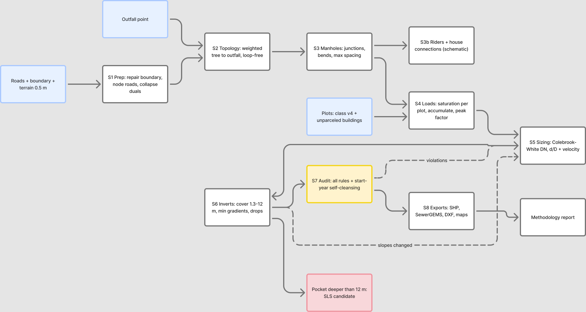

# W4 — Sewer Network Design Pipeline: Design Plan (for review)

**Date:** 2026-08-18 · **Status:** awaiting user review — no pipeline code written yet
**Goal:** a re-runnable Python pipeline that turns roads + plots + terrain + an outfall into a guideline-compliant gravity sewer network (manholes, sized pipes, inverts, loads), proven on the 551 ha test boundary first, then applied study-wide. Outputs: SHP (SewerGEMS-ready), DXF, PNG maps, methodology report.

This plan is built on five Phase A investigations (SWNETWROK autopsy, input-data inspection, criteria digest, SewerGEMS ModelBuilder research, W1–W3 code inventory). Full reports are archived in `W4/docs/phaseA/`.

---

## 1. What Phase A established

**The donor repo (SWNETWROK) gives us geometry and invert machinery — not hydraulic design.** Its transferable skeleton: road noding → outlet-snapped spanning tree per territory (loop-free by construction) → single-sweep top-down invert solver → prune-and-repool feasibility → independent constraint audit → attributed SHP/DXF. What it never does: compute a flow, size a pipe, place a manhole. So W4 keeps its skeleton and builds the entire hydraulic layer new.

**The test area is friendly.** 551 ha, 98 km of roads (fully noded, single connected component, zero overlaps), 2,825 plots (2,217 built / 522 planned / 86 agri), 55 m of fall, median slope 2.4%, terrain VRT covers it fully with zero nodata. Two data defects to handle in code: the boundary polygon has a ring self-intersection (make_valid as step zero), and `MoH_Plots_class_v4.shp` must be read with `encoding='utf-8'` (no .cpg).

**The rule set is extracted and page-cited** (§5 below). Two rules the criteria file simply doesn't have — manhole internal sizes vs depth, and the rider-sewer discharge point — get tagged assumptions until re-extracted from GUD-203.

**SewerGEMS import is a solved problem** if the export follows Bentley's rules: explicit START/STOP node labels + snapped single-part geometry digitized upstream→downstream, unique labels, numeric diameter in mm, elevations not depths, loads as a separate label-keyed table imported in a second update-only ModelBuilder run.

---

## 2. Pipeline architecture

Nine stages, each a module with one job, each writing inspectable intermediates. One driver script + one config file runs the whole chain on any (roads, plots, boundary, terrain, outfall) input set — the test boundary is just the first config.


*Editable source: [Figma board](https://www.figma.com/board/U3NFlSh7SFDL5C8jTcdQrp) — blue = inputs, yellow = the audit gate, red = SLS flag, dashed = iteration loops.*

| Stage | Module | Does | Key source |
|---|---|---|---|
| S0 | `criteria.py` | ALL numeric design values in one place, each with its G203/G201 page ref; tagged assumptions registered explicitly | 02_DESIGN_CRITERIA |
| S1 | `prep.py` | boundary repair (make_valid), clip roads (drop <0.5 m slivers), node (unary_union), dual-carriageway detect + collapse + **geometry re-anchor to corridor centerline** (new — W2 never re-anchored), plots load layer (utf-8, CLASS filter) | W1 s1 + W2 s3:37–83 |
| S2 | `topology.py` | directed tree toward outfall: **cost-weighted Dijkstra** (length + climb penalty), not the donor's hop-count BFS — less depth, fewer prune casualties; loop-free by construction; unreachable culling | SWNETWROK graph.py, upgraded |
| S3 | `manholes.py` | manholes at junctions, bends, dead-end heads, grade/diameter changes, lateral ends; subdivide long runs per Table 12 spacing (100 m @ DN200–315, re-checked after sizing); split tree edges into pipe reaches | G203 p29–30 |
| S3b | `tertiary.py` | schematic rider/PCS layer: HCC per plot frontage, ≤3 HCC per rider, PCS ≤50 m & ≥3% slope check, rider ≥1%; loads lumped at the receiving manhole (hydraulics stay at collector level — concept grade) | G203 p17–19 |
| S4 | `loads.py` | saturation load per plot (doctrine §2): built + planned + unparceled buildings, farms (CLASS=A) zero; plot→manhole assignment with **zero silent drops**; accumulate down tree; infiltration 720 L/d/km per pipe; PF at each pipe from accumulated flow | PROJECT-STATE §2, T01, a7 |
| S5 | `sizing.py` | per pipe: Qpeak → DN from series (min DN200) via Colebrook-White ks=1.5 mm partial-full; enforce d/D ≤ 0.65/0.50, v ≤ 3.0; min gradient = max(Table 11, tractive-force Smin at low-flow heads) | G203 p24–29 |
| S6 | `inverts.py` | top-down invert sweep (donor route_topdown, adapted): cover-to-crown ≥1.3 m, slope ≥ stage-S5 minimum, terrain-recovery logic; junction = deepest governs; **drop >600 mm → explicit backdrop manhole record** (external, ≤2 m, else vortex flag); depth >12 m → non-gravity pocket → **SLS candidate per rule 9** (consolidate, cascade ≤1.5 km, absorb <50 plots) — never a silent orphan | SWNETWROK hydraulics.py + G203 p30/33 |
| S5↔S6 | loop | sizing needs slope, slope comes from inverts → iterate to convergence (expected ≤3 passes; hard stop 5 with report) | — |
| S7 | `audit.py` | independent re-check of EVERY constraint incl. **mid-span cover on the 0.5 m terrain profile** (donor only checked endpoints), plot-assignment completeness, mass balance (Σ plot loads = outfall Q before PF), tree acyclicity, one outlet per manhole; PASS/FAIL CSV — "100% working" means this passes clean AND ModelBuilder imports without errors | SWNETWROK audit pattern, extended |
| S8 | `export_*.py` | `export_shp` (engineering layers), `export_gems` (SewerGEMS package per §6), `export_dxf` (ezdxf — port the donor's label-stack/flow-tick annotation engine), `maps.py` (PNG per rule 4 + QGIS group via MCP) | SWNETWROK outputs.py |

**Self-cleansing at early years** (doctrine §2.1): the audit runs twice — once at saturation loads (sizing case) and once with CLASS=B plots only (start-year proxy) to flag pipes below 0.75 m/s / tractive minimum at low flow.

## 3. What I'm deliberately fixing from the donor repo

| Donor behavior | W4 behavior | Why |
|---|---|---|
| BFS hop-count tree | length+climb-weighted Dijkstra tree | BFS routes over humps → excess depth → amputations |
| Fan-out fixed by 10 m geometric gap trim | one-outlet enforced at graph level (the donor's own dead `resolve_fanouts` idea) | sanitary manholes can't have cosmetic gaps |
| Infeasible pockets → orphans | pockets → SLS candidates per rule 9 | sewage must be collected; "orphan" isn't a sanitary outcome |
| Gap-heal edges invisible in outputs | healed edges materialized as real pipes | no hidden 0.5 m pipes in a deliverable |
| Cover audited at endpoints only | full profile audit at 5 m chainage on 0.5 m terrain | long reaches through rising ground hide violations |
| Elevation fallback 0.0 m on DEM miss | hard abort with location report | silent poison vs loud failure |
| Whole-DEM into RAM | windowed VRT reads | 0.5 m study-wide raster is tens of GB |
| Hardcoded `D:/Projects/...` paths | one config file, paths only there | portability, W5+ reuse |
| Broken/stale test suite | pytest on synthetic fixtures per module (TDD) | trust requires green tests |

## 3b. Hydraulics first — the verification regime (user mandate 2026-08-18)

Nothing hydraulic is ported on trust. The donor repo computes no hydraulics at all (autopsy §3), so the entire hydraulic layer is new — and the one donor piece with hydraulic consequences (the invert sweep) gets re-derived, not copied. The regime:

1. **Solver must reproduce the guideline before it may design.** Table 11's minimum gradients ARE Colebrook-White at 0.75 m/s with ks = 1.5 mm — so our CW partial-full implementation has to reproduce all nine Table 11 values within ±5% as a pytest gate. Fail = the solver is wrong, not the table.
2. **Hand-calc fixtures.** A set of synthetic pipes and short networks solved by hand (capacity, normal depth, velocity, invert profile with a drop and a min-slope stretch) — the pipeline must match the hand numbers before touching real data.
3. **Invert solver re-derivation.** The donor's single-sweep "aim back to min cover, deepest arrival governs" logic is reviewed clause-by-clause against G203 (uniform slope between manholes, drop rules, backdrop limits, no reverse gradients incl. the 20 mm tolerance margin). If a single downstream sweep can't honor a clause, it becomes a two-pass solver (downstream sweep + upstream relaxation). The chosen logic and its justification go in METHODOLOGY.
4. **SewerGEMS as referee, not just deliverable.** After import, the model runs and we compare pipe-by-pipe Q, v, d/D against the pipeline's own numbers. Disagreement >5% on any pipe = investigation, no exceptions. The test boundary isn't "done" until the two engines agree.
5. **Engineering review pass** on every hydraulic decision rule (PF application point, infiltration add-order, junction losses ignored-vs-modeled at concept stage) — written up with page refs in METHODOLOGY so you can audit my reasoning, not just my outputs.

## 4. Inputs (locked) and the one open input

| Input | Path | Note |
|---|---|---|
| Roads | `W1/shp/roads_study.shp` | `Lenght` field all zeros — lengths from geometry |
| Plots | `W3/shp/MoH_Plots_class_v4.shp` | authoritative load layer (CLASS B/P/A); raw MoH_Plots kept for LANDUSE lookups only |
| Unparceled buildings | `W3/shp/Unparceled_Buildings.shp` | doctrine: they carry saturation load too |
| Boundary | `Hydraulic/SHP/temp/Netwrok desing test boudary.shp` | make_valid in S1 |
| Terrain | `Data/Terrain/Sat_0p5m/IBRI_0p5_VRT2.vrt` | rule 6 (updated 2026-08-18) |
| **Outfall** | **none provided** | **open decision — see §7.1** |

## 5. Governing numbers the pipeline enforces (all page-cited in criteria.py)

- Min main diameter DN200; series DN200/250/315/400/500/600/700/800/900 (Table 11 labels); PVC-U ≤250, GRP/HDPE above (Tab 6/7, conservative reading pending NWS)
- Manhole spacing max 100 m (DN200–315), 120 m (350–900), 150/200 m above (p30 Tab 12); manhole at junctions, grade/dia changes, lateral ends
- Cover: min 1.3 m to crown (p33); max ~12 m → SLS (p33 + rule 9); drop >600 mm → external backdrop ≤2 m (p30, A9 correction: internal only on existing MH)
- Hydraulics: Colebrook-White ks 1.5 mm (p24/28); d/D ≤0.65 (D≤350) / ≤0.50 (D>350) (p27 Tab 10); v ≤3.0 m/s (p27); v ≥0.75 m/s at peak, else tractive Smin = 2.33e-4·τ^1.23·Q^-0.461 with τ=1 Pa [GAP-9 tagged] (p26–27, A9); Table 11 min gradients (DN200 = 5.0 mm/m … DN900 = 0.75 mm/m, p29)
- Tertiary: PCS OD160 @ 3–10%, ≤50 m, cover ≥600 mm; rider ≥1%, ≤3 HCC; lateral OD200 ≤45 m (p17–19, Tab 4–6)
- Loads (Tier-A fallback, tagged): 6.0 occupancy [GAP-5] × 171.3 l/c/d WWG (incl. ND+Gov area-average) ≈ **1.03 m³/d per plot at saturation**; farms zero; infiltration 720 L/d/km [pending NWS vs R0 10%]; PF default **Merrimack 2.65·Qadf^0.879** (mandatory wording >100 properties, G1-p71) with Peltier as config alternative [GAP-11] — no silent 5.0 cap, exceedances reported
- Prohibited: pipes/manholes in wadis (p30–31); manholes ≥0.5 m from kerb, mains in carriageway ≥1 m from kerb (p51 — force-main clause applied to gravity as tagged inference)

**Tagged assumptions (explicit, in criteria.py and the report):** τ = 1 Pa · OR 6.0 · 1 property/plot · manhole sizes vs depth (typical DN1000/1200/1500 ladder until GUD-203 §4.4 re-extract) · rider discharge point = nearest manhole · gravity in-road position from force-main clause · PF formula choice.

## 6. SewerGEMS export package (from Bentley-sourced research)

Four files in `W4/sewergems/`: `MANHOLES.shp` (LABEL, GRD_EL, INV_EL, MH_DIA), `CONDUITS.shp` (LABEL, START_ND, STOP_ND, DIA_MM, MANNING_N, MATERIAL, INV_UP, INV_DN, LEN_M + engineering extras SewerGEMS ignores), `OUTFALL.shp`, `LOADS.dbf` (MH_LABEL, LOADTYPE='Sanitary Pattern Load', BASEFLOW L/s, PATTERN='Fixed').
Guarantees the export makes: unique labels; single-part polylines digitized upstream→downstream; conduit endpoints vertex-snapped to node points; explicit start/stop labels (Bentley-preferred over spatial tolerance); elevations not depths; per-pipe inverts carried (drop manholes need `Set Invert to Start/Stop Node? = False` — documented in the import procedure note shipped alongside). Import = two ModelBuilder runs (elements, then loads update-only) + a documented 3-manhole pilot to verify the DBF loads route.

## 7. Open decisions for your review

0. **Division of labor (user, 2026-08-18): the MAIN pipe is user-finalized, not generated.** W2's auto-trunk ran through alleys with excessive bends — not acceptable. The pipeline takes the user's trunk alignment as fixed input; its job is the SUBNETWORKS: each grows toward a connection point on the trunk (multi-outlet), subnetwork extents fall out of invert feasibility, and non-gravity pockets become SLS proposals (rule 9). Consequence for S2: tree weights include road class/width so collectors also prefer proper streets over alleys and minimize bends.
1. **Test-area connection point(s).** Replaces the old outfall question: either the user marks the trunk/connection point(s) for the 551 ha test area up front, or the test runs with an assumed connection at the boundary's natural exit node and the real trunk swaps in later (connections are config, the pipeline is indifferent).
2. **PF default Merrimack** (guideline "is to be used") **with Peltier as a config switch** — but W2/A8 used Peltier, so the test report will show both columns for the outfall node. OK?
3. **Tertiary layer is schematic** (riders/PCS drawn and rule-checked, but hydraulic design stops at collectors; rider loads lump at manholes). Full tertiary hydraulics would be detail-design scope. OK for W4?
4. **Formula: Colebrook-White default** (Table 11's own basis), Manning available by config. OK?

## 8. Folder structure & deliverables

```
W4/
  docs/       PLAN.md (this) · phaseA/ (5 investigation reports) · img/ (Figma flowcharts)
              METHODOLOGY.md (with implementation — how the pipeline designs, human tone)
  py/         sewnet/ package (criteria, prep, topology, manholes, tertiary, loads,
              sizing, inverts, audit, export_shp, export_gems, export_dxf, maps)
              run_test_boundary.py + config_test.py · tests/ (pytest, synthetic fixtures)
  shp/        engineering shapefiles per run
  sewergems/  ModelBuilder package (§6)
  dxf/        annotated DXF (donor's label engine, re-branded)
  img/        PNG maps (rule 4 spec)
```

**Definition of done for the test boundary:** S7 audit passes with zero violations; every non-farm plot carries load into exactly one manhole; mass balance closes; DXF/SHP/PNG delivered; ModelBuilder import verified clean; **SewerGEMS run agrees with the pipeline pipe-by-pipe within 5% (§3b)**; methodology report written. Then — and only then — the same pipeline runs study-wide (per-zone, windowed terrain, the 36-zone scale risks already designed for).

## 9. Execution plan after your approval

Per-module TDD implementation plan (bite-sized tasks, each with failing test → implement → pass → commit) written to `W4/docs/IMPLEMENTATION.md`, executed with subagent-per-task review gates. Estimated order: criteria → prep → topology → manholes → loads → sizing → inverts → audit → exports → tertiary → maps → end-to-end run → methodology report.
