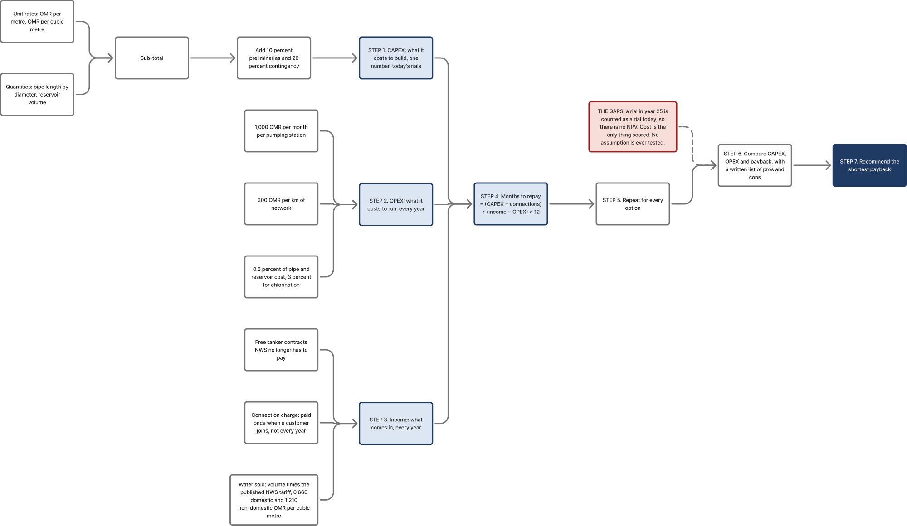

# Review of two NWS Pre-Investment Appraisal Documents

**Internal.** A financial and economic review of the two PIAD studies supplied
by a colleague, read end to end, with every quoted figure traced to the source
cell or page. The purpose is twofold: to understand how NWS actually appraises
a water investment, and to judge how much of that method we can carry into the
Ibri concept report, where PAM-GUD-201 Rev.01 governs.

| | Seeb Package 3 Phase 2 | Al Amerat Package 3 |
|---|---|---|
| Document | PIAD v2.0, 30 Aug 2023 | PIAD-07-23, Oct 2023 (rev record says 18/09/19) |
| Author | NWS Asset Planning Department, Investment Planning Zone 1 | same |
| Pages | 60 | 73 |
| Recommended cost | 33,066,420 OMR | 34,045,000 OMR |
| Stated payback | 17 months | 13 years |
| Supporting files supplied | calculation workbook, risk model, 2019 concept study | none |

Files: `Data/Financial/Seeb_P3Ph2_PIAD/`, `Data/Financial/AlAmerat_PIAD2/`.

---

## 0. The method at a glance



Three streams are costed separately — what it costs to build, what it costs to
run each year, and what comes in each year — and the three meet in a single
division that gives payback in months. That is repeated per option, and the
shortest payback wins. Everything the guideline asks for beyond cost happens in
prose, if at all.

Two terms the diagram makes explicit, because both were misread on a first
pass. A **one-off** payment is made once, when a customer joins, so the
connection charge is subtracted from CAPEX rather than added to yearly income.
And **CAPEX is not a net present value** — it is a single build cost in today's
rials. NPV is a separate result that discounts CAPEX, OPEX and revenue across
all 25 years back to today. The PIAD produces no NPV at all.

The Step 4 box carries the formula as one line. FigJam nodes are plain text, so a stacked fraction is not possible there and the box clips silently if the text runs long — the equation had to be shortened to fit. In the report the typeset version goes in the body as native Word OMML, as every other equation does.

**Still to do before this goes in the report:** the figure is 1.75:1, so it
needs a landscape page or a redraw on the grid drawer to fit a portrait column,
and the red gaps box comes out — that is our critique, not the client's.

Editable source: FigJam board
`https://www.figma.com/board/gZLeYPXMCqiI2n25w8YHmF`

---

## 1. What a PIAD is

A PIAD is NWS's **investment approval instrument**, not an engineering design
report. It exists to answer one question for the board: should this capital be
committed. It is prepared in-house by Asset Planning, downstream of a concept
study and upstream of a design contract. The Seeb PIAD sits on top of a 2019
concept study by the same department; the Amerat PIAD sits on top of a concept
study reviewed by Energoprojekt under tender 72/2017.

That framing matters. **These documents were never intended to satisfy
PAM-GUD-201's appraisal requirements**, and both predate the March 2026 revision
that binds us. Judging them against our guideline is fair only for the purpose
of deciding what to reuse.

---

## 2. The method, reconstructed

### 2.1 Capital cost

Unit rate multiplied by quantity, one line per diameter and material.

```
Sub-total   = Σ (rate OMR/m × length m) + reservoir (OMR/m³ × capacity) + lump sums
Preliminary = 10 % of sub-total          (Amerat combines the two at +30 %)
Contingency = 20 % of sub-total
Grand total = sub-total × 1.30
```

Seeb rate set, from `CAPEX OPT 4`:

| DN (mm) | Material | OMR/m | | DN (mm) | Material | OMR/m |
|---|---|---|---|---|---|---|
| 110 | HDPE | 17.0 | | 400 | DI | 114 |
| 160 | HDPE | 21.0 | | 600 | DI | 145 |
| 180 | HDPE | 28.0 | | 800 | DI | 320 |
| 225 | HDPE | 32.0 | | 900 | MS | 390 |
| 315 | HDPE | 45.5 | | 1200 | MS | 800 |
| 200 | DI | 84.5 | | 1400 | MS | 1,200 |
| 300 | DI | 90.0 | | Reservoir | concrete | 130 OMR/m³ |

Tertiary network enters as a flat 3,500,000 OMR with no basis shown.

### 2.2 Operating cost

A rule set, applied identically in all four Seeb option sheets:

| Item | Rule |
|---|---|
| Transmission mains, repair and maintenance | 0.5 % of capital cost per year |
| Reservoirs, repair and maintenance | 0.5 % of capital cost per year |
| Mechanical and electrical plant | 1.0 % of M&E capital per year |
| Distribution network | 200 OMR per km per year |
| Chlorination, operation and maintenance | 3.0 % of reservoir capital per year |
| Staff | 1,000 OMR per month per pumping station |
| O&M contractors | 10 % of staff cost |
| Insurance | 1.0 % of M&E capital |
| Power | 0.01 to 0.03 OMR/kWh, 0.02 adopted |

Lifetime operating cost is the annual figure **multiplied by 25, undiscounted**.

### 2.3 Revenue

Three streams, all incremental against a do-nothing baseline:

- **Volumetric billing** at the NWS tariff, 0.660 OMR/m³ domestic and 1.210
  OMR/m³ non-domestic.
- **Connection charges**, 700 OMR domestic and 4,200 OMR non-domestic. The
  domestic charge is recovered at 10 OMR per month.
- **Avoided cost**: free tanker contracts, 67,320 OMR/yr at Seeb, and the Oman
  Cement Company booster station O&M, 44,000 OMR/yr.

### 2.4 Decision rule

```
Payback (months) = (CAPEX − one-off connection revenue) ÷
                   (annual share revenue + annual billing + tanker saving − annual OPEX) × 12
```

Alongside it: CAPEX, annual OPEX, a yes/no on technical capability, a yes/no on
financial capability, and a prose list of advantages and disadvantages. The
recommendation follows the shortest payback and the lowest CAPEX.

**Amerat is a generation better.** It runs an actual cash-flow model: a three-year
construction period, operations starting 2028, a yearly cash-flow profile with a
3 % escalation on the tanker saving, and a cumulative free-cash-flow curve from
which payback is read. That is a recognisable investment appraisal. It is still
undiscounted, so its 13 years is a simple payback, not a discounted one.

---

## 3. Findings

Ordered by materiality. Every one is traced.

### F1 — The billing base is overstated 2.1 times *(critical)*

`Payback Period` cell C2 takes 42,324 m³/d as the volume to bill. That is the
**peak day** demand in 2045 **including losses** (`Water demand` H33). Two errors
compound:

- **Peak day is not a billing volume.** The average day is 32,557 m³/d.
- **Losses cannot be billed.** They are non-revenue water by construction. The
  billable volume is domestic plus non-domestic only: 28,310 m³/d.

The volume is therefore 1.50 times too high before the tariff is applied.

Then the split. Cells C3 and C4 assign **26 % domestic and 74 % non-domestic**.
The demand sheet the number came from has domestic at 23,592 and non-domestic at
4,718 — **83 % and 17 %**. The split is inverted, and because the non-domestic
tariff is 1.83 times the domestic one, that inversion inflates revenue again.

| | PIAD | Corrected |
|---|---|---|
| Volume billed, 2045 | 42,324 m³/d | 28,310 m³/d |
| Domestic / non-domestic | 26 % / 74 % | 83 % / 17 % |
| Annual billing | **16,257,514 OMR** | **7,767,194 OMR** |

**Annual revenue is overstated by 2.09 times.**

### F2 — Payback is therefore roughly half what it should be *(critical)*

Recomputing the PIAD's own formula on the corrected billing:

| Option | Published | Recomputed on PIAD inputs | Corrected |
|---|---|---|---|
| 2, from Bidbid | 44 months | 44.1 | **92.8 months (7.7 yr)** |
| 3, from Bawshar | 27 months | 27.0 | **56.6 months (4.7 yr)** |
| 4, new Misfah reservoir | **17 months** | 17.2 | **35.9 months (3.0 yr)** |

The formula is reproduced exactly, so the arithmetic is sound and the inputs are
not. The **ranking is unchanged** — see §4.

### F3 — Options 2 and 3 were never independently costed *(critical)*

`CAPEX OPT 2`, `OPT 3` and `OPT 4` are the same sheet. Rows 2–11, 13, 15 and 16
are identical to the digit across all three. Only two rows differ:

| | 900 mm MS | 1400 mm MS | Grand total |
|---|---|---|---|
| Option 2 | 100 m | 25,645 m | 69,077,772 |
| Option 3 | 100 m | 11,045 m | 46,301,772 |
| Option 4 | 5,444 m | 824 m | 33,066,420 |

The entire 36 million OMR spread between options 2 and 4 is the length of one
1400 mm main at a flat 1,200 OMR/m. Two consequences:

- **Options 2 and 3 carry the same brand-new 50,000 m³ reservoir as option 4**,
  at 6.5 million OMR — even though their whole rationale is that they draw on
  the *existing* Seih Al Ahmer and Al Hammam reservoirs. The options contradict
  their own descriptions.
- **Neither carries a single pumping station.** The report states that pressure
  at both connection points is insufficient. Pumping is not costed, and its
  energy is not in OPEX.

An appraisal in which the alternatives are the preferred scheme plus a longer
pipe is not an options appraisal. It is a sensitivity test on pipe length.

### F4 — Energy and labour are zero in every option *(major)*

In all four OPEX sheets, pump flow, pump head, running pumps and number of pump
stations are set to 0. So power costs nothing and staff cost nothing, in a
scheme whose own comparison table calls option 4's OPEX "high".

What the OPEX actually contains, for option 4:

| Item | Basis | OMR/yr | Share |
|---|---|---|---|
| Chlorination | 3.0 % of reservoir capital | 195,000 | **77.6 %** |
| Reservoir R&M | 0.5 % of capital | 32,500 | 12.9 % |
| Distribution R&M | 200 OMR/km × 68 km | 13,600 | 5.4 % |
| Transmission R&M | 0.5 % of capital | 10,140 | 4.0 % |
| Everything else | zero inputs | 0 | 0 % |
| **Total** | | **251,240** | |

Three quarters of the operating cost of a 33 million OMR scheme is a single rule
that charges chlorination at 3 % of a reservoir's capital cost. A 6.5 million
OMR concrete tank does not consume 195,000 OMR of hypochlorite and dosing
maintenance a year. The rule is doing work it was never calibrated for.

The total, 251,240 OMR, is **0.76 % of capital per year**. A piped distribution
system with a reservoir, chlorination and a service obligation typically runs at
1.5 to 3 % of asset value including energy, chemicals and labour. The OPEX is a
maintenance provision presented as an operating cost, and it is low by something
between a half and a quarter.

### F5 — The "250 million OMR of lost revenue" is a margin, printed inconsistently, on a wrong base *(major)*

`OPT 1 Do Nothing` cell G15 = 249,878,199 OMR. It is built as

```
(network tariff − tanker tariff) × volume × 25   for domestic and non-domestic
+ 25 years of free-tanker contract cost
+ 25 years of Oman Cement booster O&M
```

Three problems:

1. **It is a margin plus an avoided cost, not revenue.** The report calls it
   "revenue" and "revenue lost" throughout.
2. **The report says the tankers are free to the customer** (67,320 OMR/yr paid
   *by* NWS). If the water is free, do-nothing revenue is zero, not 0.220 OMR/m³.
   The document holds both positions at once.
3. **It uses the same peak-day, 26/74 base as F1**, and multiplies by 25 with no
   discounting and no ramp.

Corrected 25-year network billing: **165.8 million OMR undiscounted, 70.8 million
in present value at 5 %.** The headline overstates the present value by 3.5 times.

And it is printed as **250,000,000 OMR** for options 1, 2 and 3 and as
**250,000 OMR** for option 4 and again in the Final Conclusion — a factor of a
thousand, in the summary table of an approval document.

### F6 — The recommended option was never risk-assessed *(major)*

`Risk Assessment Model - Master - Final.xlsm`, sheet `4. RA Reporting`:

| | Total investment risk score |
|---|---|
| Pre-Investment (base case) | 107 |
| Investment Option 1 | 98 |
| Investment Options 2, 3, 4, 5, 6 | **0** |

Delivery risk is 0 for everything — that half of the model is unpopulated.
Generic risks R012 to R020 are empty shells. The file is titled "Final" and is
Appendix A of the PIAD.

### F7 — The printed cost table does not add up *(moderate)*

Report page 49:

```
Sub-Total    25,106,108
Preliminary   2,510,611     (10 %)
Contingency   5,021,222     (20 %)
Grand Total  33,066,420
```

25,106,108 + 2,510,611 + 5,021,222 = **32,637,940**, not 33,066,420. The
workbook is right — the line items sum to 25,435,708, and 25,435,708 × 1.30 =
33,066,420. The printed Sub-Total, Preliminary and Contingency lines are stale;
only the Grand Total was refreshed.

### F8 — Unit rates did not move between 2019 and 2023 *(moderate)*

The 2019 concept study and the 2023 PIAD carry identical rates:

| DN | 2019 OMR/m | 2023 OMR/m | Change |
|---|---|---|---|
| 110 HDPE | 17.00 | 17.00 | 0 % |
| 160 HDPE | 21.00 | 21.00 | 0 % |
| 225 HDPE | 32.00 | 32.00 | 0 % |
| 600 DI | 144.98 | 145.00 | 0 % |
| 800 | 320.00 (MS) | 320.00 (**DI**) | 0 % |
| 900 MS | 390.00 | 390.00 | 0 % |
| 1200 MS | 800.00 | 800.00 | 0 % |
| Reservoir | 120 OMR/m³ | 130 OMR/m³ | +8.3 % |

Four years, spanning a global polymer and steel price shock, with no movement.
The PIAD's statement that capital cost is "based on the prices submitted in
recent tenders" is not supported by its own numbers. Note also that 800 mm
changed material from mild steel to ductile iron while keeping the same rate.

### F9 — Two demand methods disagree by 84 %, and both are in the report *(moderate)*

| | 2045 average day | 2045 peak day |
|---|---|---|
| Report Table 2 and 4, plot-count method | 59,765 m³/d | 77,694 m³/d |
| Workbook, population-projection method | 32,557 m³/d | 42,324 m³/d |

The network was presumably sized on the first; the financial case uses the
second. The report also states non-domestic demand is 20 % of domestic (Table 3)
while its own Table 2 puts Al Misfah non-domestic at nearly twelve times
domestic. The Labour City enters the report at 100,000 capita and the workbook
at 50,000.

### F10 — Provenance is broken *(moderate)*

Four external workbook links, none supplied:

- Population growth rates come from `7_PAW - Regional Projection Model
  **Sharqiyah**.xlsx` — a **different governorate** applied to a Muscat project.
- The demand chain reads `'[2]New population estimate'` and `'[3]Water demand'`
  externally, although sheets of those names exist inside the file.
- The recommended option's CAPEX is read from `'[4]Cost Estimation (PIAD)4'!F20`,
  an earlier version of the same workbook held in a personal OneDrive.
- One link points at an Excel autorecover temp file in a user's AppData.

`ss.xlsx` is byte-identical to the file marked "(Final)" — a duplicate, not a
variant.

### F11 — Units and totals are loose throughout *(minor, but it is a client-facing document)*

- "0.220 baiza/m³", "0.660 baiza/m³" and "1.210 riyals/m³" in the same table.
  All three are rials.
- The payback sheet labels 4,300 ÷ 7,632 as "Occupancy Rate". It is a connection
  take-up ratio.
- Connection revenue appears three different ways: 700 OMR × 5,036, 700 OMR ×
  2,000, and 10 OMR/month × 2,000.
- Amerat quotes its do-nothing tanker cost as 60 k, 59,530 and 73,970 OMR/yr in
  one table, and its package cost as 34,045 k, 22,472 k, 20,269 k and 10,465 k
  in different places.
- Amerat's printed payback inputs (34,045,000 CAPEX; 7,750,000 billing +
  1,785,000 share − 275,000 OPEX) give a payback of **3.6 years**, not the 13
  stated. Its own summary table uses 2,458 k of revenue, which is consistent with
  13 years. The printed inputs and the printed answer are irreconcilable, and the
  model was not supplied.
- `OPT 1 Do Nothing` refers to "non domestic demand in **Liwa Wilayat**" — a
  template artefact from another project, left in a final document.

---

## 4. What survives

**The recommendation is right, and the analysis supporting it is not.**

Rebuilding the appraisal on the guideline basis — 25 years, 5 % discount rate,
CAPEX drawn down 20/35/35/10 over four years, corrected billing, operations from
2028:

| Option | PV CAPEX | PV OPEX | **PV life-cycle cost** | PV revenue | **NPV** | Discounted payback |
|---|---|---|---|---|---|---|
| 2, from Bidbid | 64,738,127 | 4,808,712 | 69,546,840 | 82,476,052 | 12,929,213 | 24 yr |
| 3, from Bawshar | 43,392,975 | 3,742,193 | 47,135,167 | 82,476,052 | 35,340,885 | 17 yr |
| **4, new reservoir** | 30,989,102 | 3,058,817 | **34,047,919** | 82,476,052 | **48,428,134** | **12 yr** |

Option 4 wins on every measure, and it wins by 27.8 % on life-cycle cost against
its nearest rival — far outside any 10 % tie-break band. All three options remain
NPV-positive, so the do-nothing case is genuinely the worst outcome, which is the
one substantive thing the PIAD's do-nothing section was trying to say.

**So the errors are not decision-changing here.** They would be in a closer case,
and they are wholly decision-changing for anything that depends on the *magnitude*
rather than the ranking: budget setting, price-control submissions, tariff
justification, or a board's view of how quickly capital returns.

The undiscounted × 25 convention alone overstates the operating cost of every
option by 2.05 times relative to its present value. It is unbiased across
options, so it does not shift a ranking — but it is not a life-cycle cost, and it
should not be called one.

---

## 5. Against PAM-GUD-201 Rev.01

| Guideline requirement (G201 §12.6–12.9, pp.104–106) | PIAD |
|---|---|
| 25-year appraisal period | Yes, 25 years |
| **5 % discount rate** | **Absent — nothing is discounted** |
| Total lifetime cost as a criterion | CAPEX and OPEX shown separately; no NPV |
| Sustainability: carbon, circular economy, nature-based solutions | Absent |
| Social development and in-country value | Absent |
| Adaptability and resilience | Partly, as prose |
| Operability | Partly, as prose |
| Constructability | Absent |
| Environmental impact | A one-paragraph section |
| **Weighted scoring, weights set by NWS** | **Absent — prose advantages and disadvantages** |
| Sensitivity on weighting, discount rate, design criteria | Absent |
| 10 % tie-break to the greener option | Absent |
| Three archetype options | No — options are variants of one scheme |

Six of the seven guideline criteria have no counterpart. Nothing is discounted.
There is no scoring and no sensitivity. **The PIAD method does not meet our
appraisal obligation and cannot be adopted as one.**

Two things the PIAD has that our seven criteria do not:

1. **Revenue and payback.** Every one of our criteria is a cost or an impact.
   None captures income. Both PIADs lead their recommendation with payback, so
   it is demonstrably how NWS reads an investment case.
2. **A costed do-nothing baseline.** Our three archetypes are all build options.
   Without a baseline, incremental revenue and avoided cost have no meaning, and
   payback cannot be computed at all.

---

## 6. What to adopt for Ibri, and what to reject

**Adopt**

- The **CAPEX structure**: unit rate × quantity by diameter and material,
  reservoir and structures at OMR per m³, then preliminaries and contingency as
  a stated percentage. It is transparent and it is what NWS expects to see.
- The **rate set as a starting point**, tagged 2019 vintage and escalated to
  the tender date. It is the only NWS-sourced cost data we hold.
- The **OPEX rule structure** — percentage of capital by asset class, plus a
  per-km network allowance, plus staff per station. Recalibrate the percentages;
  keep the shape.
- **Amerat's cash-flow model**: construction period, operations start year,
  annual profile, escalation, cumulative curve. Add discounting and it becomes a
  proper appraisal.
- **The NWS risk model** as the instrument for Section 36 — a 5 × 5 likelihood
  and impact matrix, scored per option against the existing network as base case,
  split into investment and delivery risk, with bespoke descriptors per risk.
  Score **every** option, which is precisely what was not done at Seeb.
- **Option 0, do nothing**, costed. For Ibri that means continued tanker haulage
  to the existing plant, septic tank emptying, and the environmental and public
  health consequences of no collection.

**Reject**

- Billing on peak-day volume. Bill on **average day, billable volume only,
  losses excluded**.
- The 26/74 split. Derive it from the actual land-use allocation.
- Undiscounted × 25. Use **NPV at 5 %**, with sensitivity, as G201 requires.
- Chlorination at 3 % of reservoir capital, and any OPEX with zero energy and
  zero labour.
- Options that differ only in one quantity. Each of our three archetypes must be
  costed as designed, including its own pumping, its own storage and its own
  energy.
- Calling a tariff margin "revenue".

---

## 7. Recommendations

1. **Build the Ibri cost model with a discounted cash flow from the start**,
   25 years at 5 %, with the CAPEX profile, the construction period and the
   connection ramp explicit. Payback and NPV then both fall out of one model.
2. **Add payback and a costed Option 0 to the options doctrine.** They sit
   alongside the seven criteria, not inside them: the seven decide which scheme,
   payback tells NWS what the money does.
3. **Escalate the 2019 rates to a stated base date** and say so in the report.
   Do not repeat the PIAD's claim of "recent tender prices" over four-year-old
   rates.
4. **Calibrate OPEX bottom-up for the sewer and the plant** — energy from the
   actual pump duty, chemicals from the actual dose, labour from the actual
   establishment. Sewerage OPEX is dominated by pumping energy and sludge
   handling, neither of which a percentage-of-capital rule captures.
5. **Score the risk model for every option**, and populate delivery risk.
6. **Sanity-check every revenue figure against the volume it is billed on.**
   The single largest error in both documents is a volume that was never
   billable.

### Revenue for Ibri is a different problem

One structural difference from these two studies, and it needs to be settled
with NWS before any payback is quoted. Both PIADs are **water supply** schemes,
where the revenue is a metered volumetric tariff on water sold. A **sewerage**
scheme has no equivalent: in Oman wastewater is not generally billed by volume
to the connected household, and the treated effluent is sold, if at all, at a
rate NWS sets against irrigation demand rather than cost.

So the Ibri revenue case rests on three quite different streams, and each needs
a decision from NWS:

- **Connection and sewerage charges** — whether any exist, and at what rate.
- **Treated effluent sales** — volume, offtaker and price, which is where the
  circular-economy criterion and the financial case meet.
- **Avoided cost** — tanker haulage to the existing plant, septic emptying, and
  the deferred cost of the 29,038 m³/d plant already coded in NWS's own asset
  planning as SUREKHA.

For a sewerage scheme the avoided-cost stream will very likely dominate, which
is the opposite of the Seeb and Amerat cases where volumetric billing carried
the whole argument. That should be said plainly in the report rather than
discovered late.
